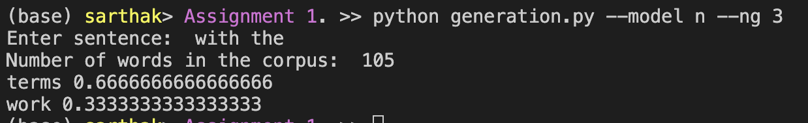
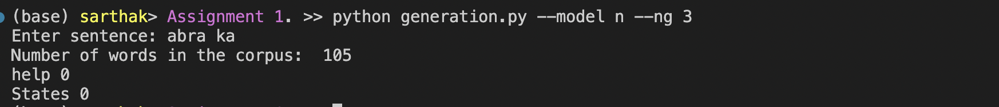
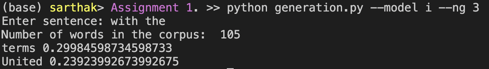
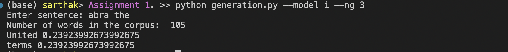

# INLP ASSIGNMENT - 1
SARTHAK BANSAL , 2021101134

## Tokenisation
- Detected Punctuations taking extra care about those which seperate words and those which seperate lines . Special care was taken about the '.'
- Divided the text into sentences and further into words making a 2D List
- Then the following types were replaced by placeholder
    - Numbers
    - Mail Ids
    - URLs
    - Hash
    - Mentions
    - Ids

- To run the file ,  simple do  
    ```
    python tokeniser.py 
    ``` 
    It will prompt you to enter the text

## N gram
- This function `NgramModel` , present in language_model.py generates frequency count for all the n-grams in the corpus
- The function `NgramProb` generates probability of a given sentence from the given frequency counts

## Good-Turing Smoothing
- The function `GoodTuringMethod` present in language_model.py generates probability of a sentence given the corpus 
- It first calculates freqoffreq list which is nothing but Nr for different r (frequency)
- It normalises Nr by the nearby non-zero values
- It then fits a line between log(Nr) and log(r) using linear regression
- We then use the formula present in slides to compute conditional probability

## Linear Interpolation
- The function `LinearInterpolation` present in language_model.py generates the probability of a sentence given the corpus 
- We estimate the parameters using the algorithm described in the resource
- We then estimate all the trigram , bigram and unigram counts
- We then use the formula present in resource to get sentence probability

### To run language_model.py
```
python language_model.py --corpus_path <path to corpus> --model <i/g>
```
It will prompt you to enter the sentence

## Generation
- The function `WordPrediction` in generation.py generates the 'k' highest probable words given a sentence

To run the file , 
```
python generation.py --corpus_path <path to corpus> --model <i/n> --k <number of words> --ng <N in ngram-model>
```
It will prompt you to enter the sentence
### Here are a few examples

N gram model without Smoothing


N gram model without Smoothing with OOV


N gram model with Linear Interpolation


N gram model with Linear Interpolation with OOV
